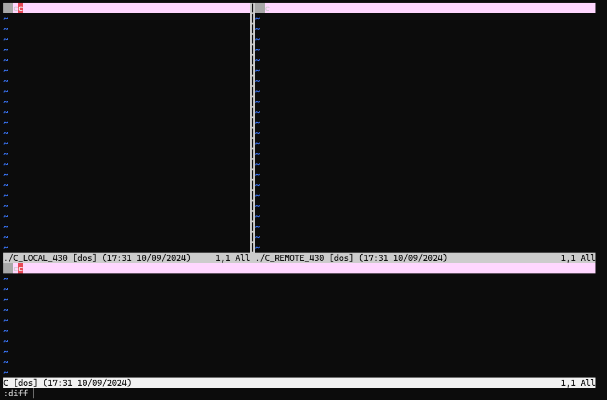

# Merge conflict

## 이게 Merge?

Git은 혼자만 사용하는 도구가 아니고, 또한 혼자만 사용하더라도 한 곳에만 저장소를 복제하기 위한 도구가 아니다. 그렇기 때문에 같은 버전에 대해 여러 수정본이 생긴다면, 그 수정본들을 하나로 합치는 작업 역시 발생하게 될 것이고, Git은 이런 문제까지도 해결해주는 아주 멋진 도구다.

같은 분기에서 갈라진 두 개의 커밋이 다시 하나로 합쳐지는 과정을 Git에서는 Merge(이하 머지, 혹은 병합)라고 한다.

## Git Log

```sh
git log --graph # Git 커밋 역사 확인 + 시각적으로 표현
```

`git log` 명령을 사용하면 커밋 역사를 볼 수 있는데, 여기에 Flag로 `--graph`를 넣으면 시각화가 되어 보여진다.

아래는 나의 프로젝트 중 하나의 머지가 발생했던 예시를 커밋 메시지를 가리고 가져온 것이다.

```sh
* commit 36a4bbe01af5f3febb88104c4377a51c527bcbdf
| Author: elecbug <deveb147p@gmail.com>
| Date:   Thu Aug 1 17:07:10 2024 +0900
|
|     [COMMIT_MESSAGE]
|
*   commit b697522ede1639af1ee4cb0e0adbd8ad4ce6aa86
|\  Merge: 3cbb26d ea878fa
| | Author: deveb1479@gmail.com <deveb1479@gmail.com>
| | Date:   Thu Aug 1 17:00:17 2024 +0900
| |
| |     Merge branches 'go' and 'go' of [REPO_PATH] into go
| |
| * commit ea878fab7a52b94dcddd8717209ac3400815c8fd
| | Author: elecbug <deveb147p@gmail.com>
| | Date:   Thu Aug 1 16:53:21 2024 +0900
| |
| |     [COMMIT_MESSAGE]
| |
* | commit 3cbb26db6ab455faf7d1301e0d3b6bfbbebd52f8
|/  Author: deveb1479@gmail.com <deveb1479@gmail.com>
|   Date:   Thu Aug 1 16:44:26 2024 +0900
|
|       [COMMIT_MESSAGE]
|
* commit 3529b090e8fe6549e9d6570b3f264db5c59d8d4d
| Author: elecbug <deveb147p@gmail.com>
| Date:   Thu Aug 1 16:28:08 2024 +0900
```

상황이 발생한 원인은 A 컴퓨터에서 작업하던 내용을 푸시하여 `3529`->`3cbb`(커밋을 가리킬 때는 보통 커밋의 고유 해시 4~6자리로 표현한다)를 만들어 놓고, B 컴퓨터에서는 `3529` 상태에서 풀을 잊어버려, 그대로 다음 커밋인 `3529`->`ea87`을 만든 경우이다. 이렇게 되면 두 커밋 분기는 같은 커밋 `3529`에서 유래된 다른 내용이므로, 머지 작업이 필요해지게 된다.

위 출력 창에서는 어쨋든 머지에 성공하여, 두 개의 `go` 브런치의 커밋 분기가 결합하여 `3529`->`3cbb + ea87`->`36a4`를 이룬 모습을 볼 수 있다.

## 실습

### 고의 충돌

위와 같은 실수를 하지 않는게 가장 좋겠지만, 실수는 누구나 하기 마련이고, 실수를 하지 않는다고 해서 머지를 배우지 않아도 된다는 의미는 아니다. 다음 장에서 배우겠지만, 머지는 단순히 실수를 해결하기 위한 도구라기보다는 공동 작업을 진행할 때 여러 사람의 수정본을 합치는 의미가 강하다. 따라서 우리는 연습을 위해 고의로 충돌을 발생시키고 문제를 해결해 볼 것이다.

#### 파일 충돌 없음

충돌에는 크게 두가지 상황이 있다. 두개의 머지 대상 커밋이 같은 파일에 대해 서로 다른 수정을 만들었는가, 그렇지 않은가이다. 쉽게 말해서 복제된 저장소 A와 B가 있을 때, `my-repo/conf.txt`를 A도 수정하고 B도 수정했다면 최악의 케이스이다. 이 경우에는 자동으로 머지가 불가능하고, 직접 수동으로 머지할 부분을 체크해야 한다.

그에 반해 현재 가정할 경우는 그 정도까지는 아닌 조금 간단한 충돌이다. A에서는 `my-repo/conf_a.txt`를 커밋했고, B에서는 `my-repo/conf_b.txt`를 커밋했다. 이 경우 충돌이 발생하는 파일의 커밋이 없기 때문에 자동 머지가 이루어져, `my-repo/conf_a.txt`는 A의 수정본으로, `my-repo/conf_b.txt`는 B의 수정본으로 합쳐지게 된다.

우선은 위의 케이스를 발생시켜 보자. 이전에 쓴 `my-repo`를 두 개의 폴더에 각각 복제해온다.

```sh
mkdir ~/test1                                     # test1 폴더 생성
mkdir ~/test2                                     # test2 폴더 생성
cd ~/test1                                        # test1 폴더로 이동
git clone https://github.com/[YOUR_NAME]/my-repo  # test1 폴더에 my-repo 복제
cd ~/test2                                        # test2 폴더로 이동
git clone https://github.com/[YOUR_NAME]/my-repo  # test2 폴더에 my-repo 복제
```

이때 `my-repo`를 굳이 비울 필요는 없다. 두 복제 저장소의 최종 커밋이 같은 커밋이기만 하면 된다. 또한 만약 자동으로 GitHub 인증이 되지 않는 상황이라면, 앞장에서 다룬 방법을 사용해 클론하도록 하자.

이제 두 저장소에 서로 다른 커밋을 만들어 볼 것이다.

```sh
cd ~/test1/my-repo      # test1측 복제 저장소로 이동
echo A > conf_a.txt     # test1측에 conf_a.txt 파일 추가
git add .               # 추가
git commit -m "A side"  # 커밋
```
```sh
cd ~/test2/my-repo      # test2측 복제 저장소로 이동
echo B > conf_b.txt     # test2측에 conf_b.txt 파일 추가
git add .               # 추가
git commit -m "B side"  # 커밋
```

이제 두 버전을 각각 푸시해보자. A쪽부터 푸시를 진행하면, A는 푸시가 잘 되지만, B는 푸시가 되지 않는 모습을 볼 수 있다. 여기서 두 가지 해법이 등장한다. Fetch(이하 패치)와 풀이다.

두 버전은 서로 다른 Git 기록을 가지고 있고, A가 먼저 푸시를 해버렸기 때문에 원격 저장소는 A의 버전을 가지고 있다. 따라서 현재 B측 복제 저장소는 원격 저장소와 충돌이 발생하기 때문에 어떻게든 원격 저장소에서 변경된 Git의 기록을 B측으로 "끌고 와야" 한다.

따라서 `git pull`은 유효하게 작동한다. 풀 될 대상 중에 현재 B측과 직접 충돌할 파일이 없기 때문에, 원격 저장소의 Git 정보와 파일까지 모두 안전하게 내 B에 합쳐진다. 이상태로는 푸시가 가능하며, 따라서 이렇게 파일 충돌이 없는 케이스는 간단하게 문제가 해결 되었다.

잠깐? 그럼 패치는 뭘까? 위에서 풀은 변경된 원격 저장소의 Git 정보와 파일을 모두 가져온다고 하였다. 만약 변경된 내용이 굉장히 많다거나 하는 이유로 당장 변경된 내용을 굳이 B로 끌고 오고 싶지 않다면, Git 정보만 받아올 수도 있다. 즉, 패치를 적용하면 Git 정보를 B에 복사하여 저장소만 정상화하고, 푸시가 가능한 상태로 만드는 것이다.

그러므로 필요에 따라 아래의 두 루틴 중 하나를 따르면 자동 머지는 쉽게 해결할 수 있다.

|Pull|Fetch|
|----|-----|
|`git pull` 후 `git push`|`git fetch` 후 `git push`|

```sh
*   commit 39839ce151e7d60a2077e22b508e47d71b9f107c (HEAD -> master)
|\  Merge: 6d60cef 6e4bc8e
| | Author: deveb1479@gmail.com <deveb1479@gmail.com>
| | Date:   Tue Sep 10 17:17:42 2024 +0900
| |
| |     Merge branch 'master' of https://github.com/elecbug/my-repo
| |
| * commit 6e4bc8e7251b05d0595e6e64cd1071bf469f7d22 (origin/master, origin/HEAD)
| | Author: deveb1479@gmail.com <deveb1479@gmail.com>
| | Date:   Tue Sep 10 17:12:21 2024 +0900
| |
| |     A side
| |
* | commit 6d60cef5116bcb779a27fd67063ce75a7417abeb
|/  Author: deveb1479@gmail.com <deveb1479@gmail.com>
|   Date:   Tue Sep 10 17:12:36 2024 +0900
|
|       B side
|
* commit 547c38aa78ae7e51b2a2e92aad439fb998332baa
```
- 정상적으로 머지된 모습

#### 파일 충돌 있음

사실 나라면, 충돌이 발생한 파일 중 더 예전에 작성한 버전을 밀어버리고, 파일 충돌 없음의 케이스로 푸시할 것이다. 우선은 아까와 같이 고의로 충돌을 일으키고 실험해 보자. 양쪽 저장소에 `C`라는 파일을 추가하고 내용을 다르게 써보았다. 그 뒤 위와 같은 순서로 시도해 보자.

```sh
$ git push
To https://github.com/elecbug/my-repo
 ! [rejected]        master -> master (fetch first)
error: failed to push some refs to 'https://github.com/elecbug/my-repo'
hint: Updates were rejected because the remote contains work that you do
hint: not have locally. This is usually caused by another repository pushing
hint: to the same ref. You may want to first integrate the remote changes
hint: (e.g., 'git pull ...') before pushing again.
hint: See the 'Note about fast-forwards' in 'git push --help' for details.

$ git pull
remote: Enumerating objects: 4, done.
remote: Counting objects: 100% (4/4), done.
remote: Compressing objects: 100% (1/1), done.
remote: Total 3 (delta 1), reused 3 (delta 1), pack-reused 0 (from 0)
Unpacking objects: 100% (3/3), 236 bytes | 23.00 KiB/s, done.
From https://github.com/elecbug/my-repo
   6e4bc8e..8b3accd  master     -> origin/master
warning: Cannot merge binary files: C (HEAD vs. 8b3accd898225fb39f35a2982749ba6cc6ef18b7)
Auto-merging C
CONFLICT (add/add): Merge conflict in C
Automatic merge failed; fix conflicts and then commit the result.
```
- 푸시도 풀도 불가능한 모습

자, 보다시피 자동 병합에 실패해 버렸다. 두 버전이 같은 파일 `C`를 수정하였기 때문이다. 두번째 푸시를 시도한 저장소에서 다음과 같이 입력해보자.

```sh
git mergetool
```

Git에서 자체적으로 지원하는 수동 병합 도구이다. 위 커맨드를 입력하면 `vimdiff`를 쓸 거냐고 물어볼텐데, `vimdiff`라고 다시 한번 입력해주면 된다.

`vimdiff`는 기본적으로 다음과 같은 형식을 따른다.

```sh
  ╔═══════╦══════╦════════╗
  ║       ║      ║        ║
  ║ LOCAL ║ BASE ║ REMOTE ║
  ║       ║      ║        ║
  ╠═══════╩══════╩════════╣
  ║                       ║
  ║        MERGED         ║
  ║                       ║
  ╚═══════════════════════╝
```

우리의 경우 새로 만든 파일을 수정했기 때문에, 저 BASE 부분이 빠진 것으로 볼 수 있다. 이전 커밋에서는 `C`라는 파일이 없었고 이번 커밋에서 처음 등장했기 때문이다.

`vimdiff`에 들어오면 `:`을 찍어 커맨드 모드를 사용할 수 있게 되는데, 여기에 아래와 같이 입력하여 설정을 조정한다.

|Command|Description|
|-------|-----------|
|`:diffg [RE]`|원격 저장소의 내용으로 (즉 GitHub의 내용으로) 정한다|
|`:diffg [BA]`|기존 저장소의 내용으로 (즉 충돌이 발생하기 전으로) 정한다|
|`:diffg [LO]`|로컬 저장소의 내용으로 (즉 현재 내 컴퓨터의 내용으로) 정한다|



현재 분홍색으로 음영 처리된 부분이 현재 수정중인 충돌 부분이며, 여기서 차례로 커맨드를 입력하여 충돌을 제거한다.

나는 c가 하나만 적힌 원격 저장소의 버전을 택할 생각이고, 따라서 `:diffg [RE]`를 사용하겠다. 지금 내 원격 저장소의 명칭은 `C_REMOTE_430`이므로 `:diffg C_REMOTE_430`을 입력하면 된다.

그러면 MERGED 영역, 즉 최종본의 해당 충돌 부분이 원격 저장소의 부분으로 수정된 것을 볼 수 있다. 여러개로 분할된 화면 사이를 오가려면 `Ctrl + W`를 사용할 수 있다. 모든 문제를 해결하였다면, `:wqa`를 사용하여 나가자.

이제 충돌 문제가 해결된 것 같으니 `add`, `commit`, `push`의 순서대로 실행하면 정상적으로 문제를 해결하고 푸시된다. 난잡한 충돌을 직접 해결해보면 절로 가슴이 웅장해지는 기분을 느낄 것이다.

"어라? 생각보다 쉬운 것 같은데, 왜 다 밀어버리고 한 버전으로 푸시한다고 하신거에요?"

사실 그렇게 어렵지 않은 것은 사실이다. 하지만 충돌 코드가 100~200줄이 넘어가는 케이스라면, 저렇게 수정하면서 예전 버전에서 건질 것을 찾기 어려울 것이다. 그렇기 때문에 나는 시간 절약을 위해서 `reset`를 사용하여 예전 버전으로 돌아가서 커밋을 수정하는데, 아래와 같이 사용한다. ~~사실 저 특유의 vim이 불편해서 이렇게 한다~~

```sh
git reset [COMMIT_HASH] [--hard|--soft| ] # 특정 커밋 버전으로 되돌아가는데, --soft/hard를 입력하거나 아무것도 입력하지 않음
```

`[COMMIT_HASH]`에 돌아가려는 커밋의 해시를 넣어 돌아간 뒤, 충돌이 일어나는 파일을 삭제하고, 다시 커밋하여 푸시하면, 문제가 해결되는 것을 볼 수 있을 것이다.

여기서 일반 reset과 `--hard`와 `--soft`의 차이를 알아보자. 일반 리셋과 소프트 리셋은 현재 파일 상태를 건드리지 않고 해당 버전으로 돌아가는 것이다. 일반 리셋은 여기서 한 술 더 떠 `git add` 이전까지 돌아가며, 소프트 리셋은 `git add`까지는 되어있는 상태로 돌아간다.

> 여태까지는 등록 정도의 용어를 사용했다면 전문 용어로 `git add`를 Stage(이하 스테이지)라고 한다. 앞으로는 두 용어가 혼용될 수 있다.
>

하드 리셋은 이름을 보면 감이 오겠지만, 완전히 그 버전으로 그대로 돌아가는 것이며, 파일을 지우기 때문에, 따로 백업이 되어있지 않다면 애꿎은 다른 파일까지 함께 증발할 가능성이 높다. 따라서 잘 사용하지 않고, 원만하게 해결하는 것을 추천한다.

## 미션
`git push --force`에 대해 조사해보자.

---

### References
1. Test alone
2. [freeCodeCamp - Git Fetch와 Git Pull 명령어의 차이점](https://www.freecodecamp.org/korean/news/git-fetch-vs-pull/)
3. [stack overflow - How do I resolve merge conflicts in a Git repository?](https://stackoverflow.com/questions/161813/how-do-i-resolve-merge-conflicts-in-a-git-repository)
4. [Medium - [git] 이전 commit으로 돌아가기](https://medium.com/@kwoncharles/git-%EC%9D%B4%EC%A0%84-commit%EC%9C%BC%EB%A1%9C-%EB%8F%8C%EC%95%84%EA%B0%80%EA%B8%B0-cf6caed43ed5)

<p align=center><a href="../README.md">Go to main menu</a></p>