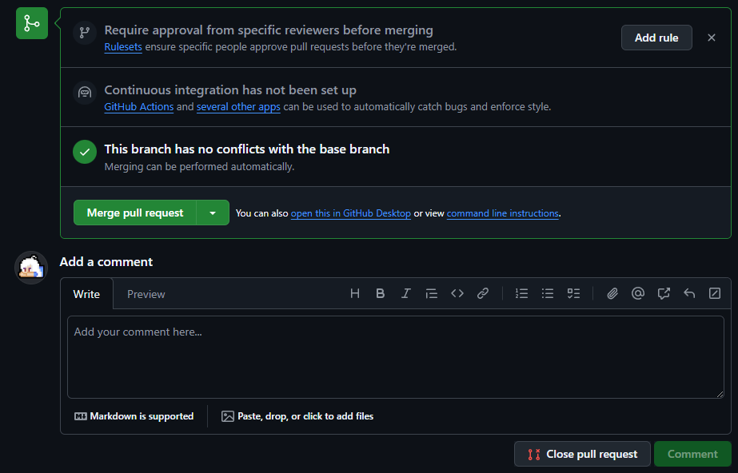

# Fork and PR

## What is Fork

Fork(이하 포크)란 다른 사람의 공개 저장소(일반적으로 공개이지만, 접근이 허용된 비공개 저장소도 포함)를 내 Repositories로 복제본을 떠오는 것이다. 복제된 원격 저장소는 모든 내용이 동일하며, 다만 주인이 나로 바뀌었을 뿐이다.

포크는 정확히 말하자면 Git 고유의 기능은 아니다. Git은 어디서든지 저장소만 찾을 수 있다면 클론이 가능하며, 또한 별도의 보안 장치가 없다면 푸시도 일반적으로 가능하다. 포크는 GitHub에서 제공해주는 기능으로, 프로젝트에 여러명의 참여자가 동시에 기여할 수 있도록 하기 위해 만들어진 기능이다.

포크된 저장소는 주인이 나로 바뀌었기 때문에 원본 저장소와 별개로 복제도니 순간부터 내가 마음대로 편집이 가능하다. 내가 수정하고 싶은 부분을 마음대로 수정할 수 있다는 이야기이다. 포크를 진행하는 방법은 간단한데, 저장소의 우측 상단의 `Fork`를 클릭하면 된다.

그럼 아래와 같은 창이 뜰건데 `Create Fork`를 눌러 복제하자.

> 참고로 나는 시연을 위해 내 저장소를 다른 계정 쪽의 저장소(Organization)로 포크하였다. 일반적으로 내 저장소를 같은 계정에서 포크하는 것은 불가능하니, 따라할 때 참고 바란다.
>

그러면 복제된 측으로 이동하여 어디서 복제해온 저장소인지 등에 대한 한 줄의 메시지를 볼 수 있다. 이제 마음대로 파일을 수정할 수 있다.

간단하게 파일 하나만 추가로 커밋해본 뒤, 이번에는 PR을 진행해보자.

## What is PR

PR은 Pull request(이하 풀 리퀘스트, 풀맄)의 약자로 내가 포크해온 저장소를 원본으로 머지 요청을 보내는 것이다. 원본의 관리자는 풀맄의 정보를 보고, 적합성을 판단한 뒤 승인 혹은 거부를 진행하게 되며, 이 과정을 Contribute, 기여라고 한다.

파일이 하나 커밋되자 원본 저장소(`elecbug/my-repo`)에 비해 복제된 저장소가 1 커밋 앞서있다고 설명한다. 즉 원본에 비해 더 많은 수정이 이루어졌고, 이제 저 `Contribute -> Open pull request` 버튼을 누르면 풀 리퀘스트가 가능하다.

내가 만든 `my-repo`는 허접한 임시 저장소인지라 양식이 없지만, 대부분의 오픈소스 프로젝트는 풀맄의 양식이 존재하며, 양식에 맞추어 내용을 작성하고 `Create pull request`를 눌러 풀맄을 완료할 수 있다.

여기까지는 기여자의 일이며, 이후부터는 관리자의 일로 넘어간다.

### Merge PR

관리자는 레포지토리를 들락거리다, 나의 소중한 풀맄을 봐줄 것이고, 그 내용을보고 승인 혹은 거부할 수 있다.

`Merge pull request`를 눌러 승인하거나, `Close pull request`를 눌러 거부할 수도 있다. 어쨋든 대부분의 경우에는 `Comment`를 이용해 승인 및 거부의 이유를 설명해 줄 것이다. ~~사실 승인은 대부분 마음에 드는 순간 Thanks 한 줄 쓰고 승인 해버린다~~

머지가 완료되면, GitHub에서 이메일이나 알림이오고, 나는 해당 프로젝트의 기여자가 된다.

- 내 첫 오픈소스 기여를 가져온 것이다. [`actix-website`](https://github.com/actix/actix-website/)라는 Rust 언어 백엔드 프레임워크다.

거대한 오픈소스는 견고할 것 같지만, 그들도 사람인지라 실수가 있기 마련이다. 따라서 오픈소스를 포크해서 기여하는 것은 색다른 경험이자 이력이 될 수 있다.

## 미션

마음에 드는 오픈소스를 찾아 포크 및 풀맄을 통해 기여를 진행해보자. 어쩌면 이 WelcomeGit에도 고칠 부분이 보일지 모른다.

---

### References
1. Test alone

<a href="../README.md">Go to main menu</a>
