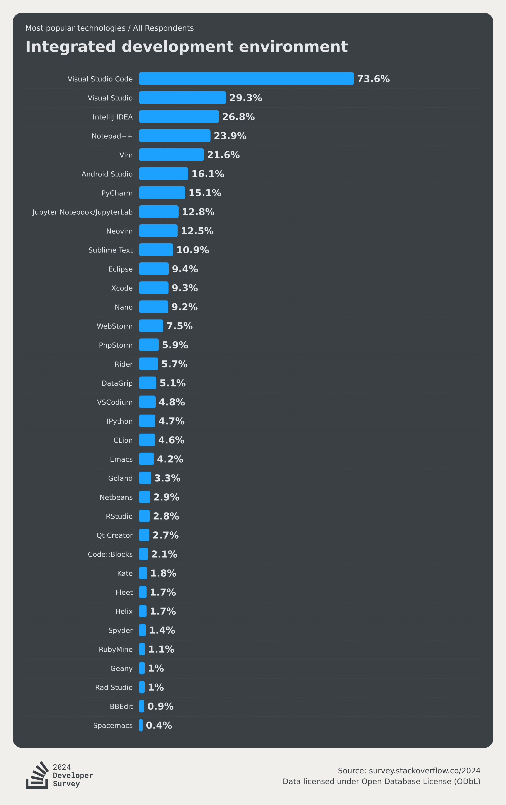
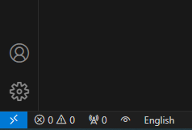
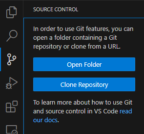
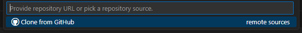
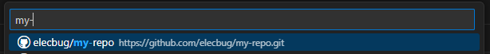
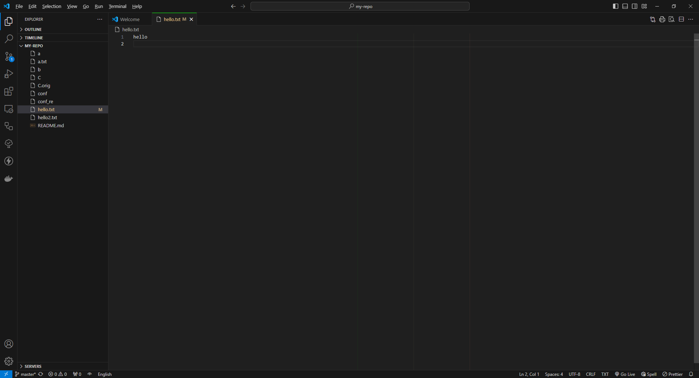
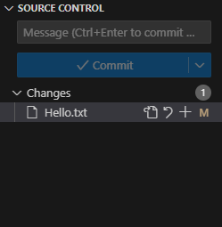
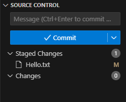
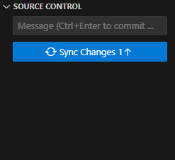

# VS Code is GOAT

> GOAT; Greatest Of All Time

## IDE보다 좋은 Text Editor

[Visual Studio Code](https://code.visualstudio.com/)(약칭 VS Code, Code)는 마이크로소프트에서 제공하는 역사상 최고의 **텍스트 에디터**이다. 최고의 개발 도구라는 명예가 **IDE**가 아닌 Text Editor에게 돌아간 것은 조금 웃기면서도, 어쩌면 현재 개발자들의 선호도가 뛰어난 IDE 보다는 개인의 기호에 맞추어 수정이 가능한 범용 텍스트 에디터라는 의미일지도 모르겠다.

- 스택 오버플로우에서 조사한 선호 개발 도구. 압도적으로 승리한 VS Code를 볼 수 있다.

VS Code는 전통적인 의미의 IDE보다는 텍스트 에디터에 가깝긴 하지만, [Extension](https://code.visualstudio.com/docs/editor/extension-marketplace)이라는 특유의 기능을 활용하면 IDE 이상의 성능을 발휘하는 슈퍼 텍스트 에디터로 만들 수 있는데, 예를들어 C/C++ 도구를 다운로드 받으면 C/C++ Debug 및 Compiler로 사용하는 것 등이 가능하다는 이야기이다. 그리고 오늘 얘기할 VS Code용 Git 도구도 그렇다.

## Source Control

VS Code용 Git 도구는 별도의 설치 과정 없이, 내 컴퓨터에 Git이 설치되어 있다면, VS Code를 켜자마자 왼쪽 내비게이션 바에 표시되게 된다. 왼쪽의 Git 모양 버튼을 눌러 Git 창을 사용할 수 있다. 오늘은 일전에 사용한 `my-repo`를 사용하여 VS Code용 Git을 다뤄보자.

## 실습

네비게이션 바 왼쪽 아래의 사람 모양 `Accounts` 버튼을 누르면 GitHub 계정으로 로그인이 가능하다. VS Code에서 GitHub 계정으로 로그인을 해보자.

그 다음 네비게이션 바 상단의 Git 모양 아이콘을 누르면 Git 관련 창을 볼 수 있다. 만약 당신이 아무것도 없는 빈 VS Code 창에서 이 아이콘을 눌렀다면 다음과 같은 화면이 보일 것이다. 여기까지 준비해두자.

> 언어는 다를 수 있지만, 나는 개인적으로 실력이 쌓이기 전까지 IDE는 영어로 사용하기를 권장한다. 오히려 초보자일수록, 한국어 IDE를 사용하다보면 오류나 문제를 검색하기 힘들어지는 경향이 있다.
>

`Open Folder`는 폴더를 여는 것이고, `Clone Repository`는 원격 저장소를 복제해오는 역할을 한다. 이미 `my-repo`가 로컬에 복제되어 있다면, `Open Folder`로 열어서 사용할 수도 있지만, 지금은 실습의 일관성을 위해서 새로운 위치에 `my-repo`를 클론해오도록 한다.

`Clone Repository` 버튼을 누르면 다음과 같은 창이 상단 중앙에 생길 것이다. `Clone from GitHub` 버튼을 눌러서 GitHub에서 저장소를 클론할 수 있다.

그 다음 `my-repo`를 찾거나 검색하여 내 `my-repo`를 찾을 수 있고, `[YOUR_NAME]/my-repo`를 눌러 클론할 수 있다. 폴더 선택 창이 뜨면, 실습할 위치에 `my-repo`를 클론해오자.

내용은 조금 다를 수도 있겠지만, 클론된 저장소는 다음과 같이 표시될 것이다. `Explorer`(`Ctrl+Shift+E`)에서 파일을 수정할 수 있고, `Source Control`(`Ctrl+Shift+G`)에서 Git 관련 기능을 사용할 수 있다.

Explorer에서 대충 아무 파일이나 수정하고 저장하면 Source Control 창이 위 사진과 같이 ①이라는 표시가 뜰건데, 이때 Source Control 창으로 넘어가면 다음과 같은 모습이 보일 것이다.

크게 `SOURCE CONTROL`이라는 드롭박스가 보이고, 그 안에 순서대로 `Message` 텍스트 박스와, `Commit` 버튼, `Changes` 드롭박스와 아래에 파일의 목록이 보일 것이다. 순서대로 알아보자면 다음과 같다.

`Changes` 박스에 표시되는 파일들은 내가 수정을 가한 파일들의 목록, 즉 원격 저장소와 동기화되지 않은, 이제 커밋해야 할 파일들의 목록이다. 나는 `Hello.txt`의 내용을 수정하였으므로 해당 파일이 목록에 표시된다.

각 파일을 `+` 버튼을 누르거나, 혹은 `Changes` 글씨 위에 마우스를 올리면 `+` 버튼이 나타나는데, 이 버튼을 클릭하면 각 파일 혹은 모든 파일을 스테이지 할 수 있다. 그 외에도 `↶`를 누르면 해당 파일에 대해서 커밋 직전의 상태로 되돌리거나(즉, 수정 내용을 제거하거나) 할 수도 있다.

파일을 스테이지하면 `Changes`에 있던 파일이 `Staged Changes`로 이동하게 되며, `Commit` 버튼이 활성화 된 것을 볼수 있게 된다. 이제 `Commit` 버튼 위에 있는 `Message` 텍스트 박스에 커밋 메시지를 입력하고(`git commit -m [MESSAGE]`의 그 [MESSAGE]이다) `Commit`을 누르면 커밋 상태가 된다.

그러면 `Commit` 버튼이 `Sync Changes` 버튼으로 바뀐 것을 볼 수 있는데, `Sync Changes`는 VS Code에서 풀과 푸시를 모두 아우르는 명칭이다. 위로 향하는 화살표가 1개 있는 것으로 동기화 할 변경사항이 있으며, 푸시가 하나 있다는 의미를 나타내고 있다. 이제 저 버튼을 누르면 GitHub 쪽으로 변경사항이 올라가게 된다.

또한 각 과정은 터미널로 해당 과정을 수행하는 것과 동일하기 때문에, 터미널에서 한 과정을 수행하면 `Source Control` 창에 즉각 반영되며, 반대로 `Source Control` 창의 변경 사항에 이어서 터미널로 나머지 작업을 수행할 수도 있다.

## 미션

1. VS Code에는 그 이외에도 수많은 Git 관련 Extension을 제공해주고 있고, 이는 사용자들이 직접 만든 것도 많다. 마음에 드는 Extension을 다운로드 받아 VS Code를 꾸며보자.

### References
1. Test alone
2. [stackoverflow - 2024 dev survey](https://survey.stackoverflow.co/2024/technology/)
3. [Visual Studio Code - Source Control with Git in Visual Studio Code](https://code.visualstudio.com/docs/sourcecontrol/overview)

<a href="../README.md">Go to main menu</a>

